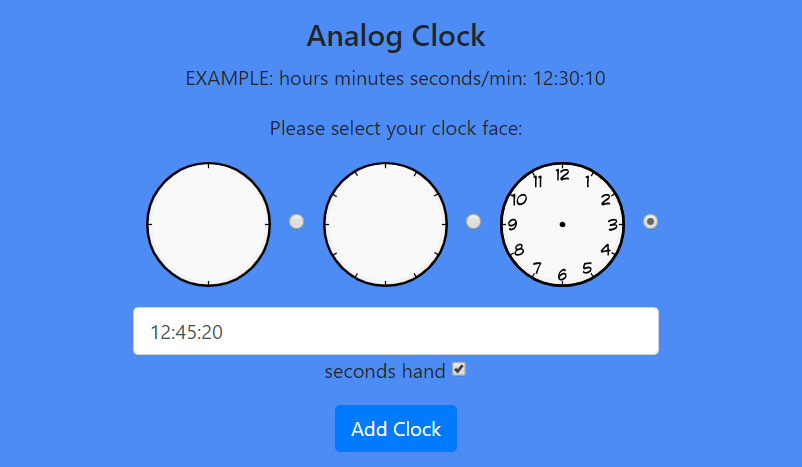

# Content Creation Tool

#### This tool is used to create shapes and SVGs 

### Canvas dimensions : 500 X 500 pixels

## Features:

#### Add shapes :

##### here we can add different geometry shapes like triangle, rectangle, circle, semicircle, polygon, line and point. we can also add text from this panel  

#### Grid with svg(2 X 6):
##### Here we can add a 2 X 6 grid with SVGs in it 
##### we have 2 inputs for top row and bottom row respectively in which we can specify the number of SVGs in each row with maximum count of 6 and click on the svg you want to fill the grid with.

Input             |  Output
:-------------------------:|:-------------------------:
 |   

#### Custom grid:
##### This is similar to the above grid except we can now customize the number of rows and columns inside the grid
##### here we have 3 inputs for rows, columns and number of SVGs in each row
Input             |  Output
:-------------------------:|:-------------------------:
 |   

#### Triangles:
##### Here we can add a triangle with a specific angle for one vertex and we can add an isosceles triangle
Input             |  Output
:-------------------------:|:-------------------------:
 |   

#### Add circle with sectors:

##### Here we can add a circle and specify the options for angle of the sector, number of sectors, number of sectors with fill colour
Input             |  Output
:-------------------------:|:-------------------------:
 |   

#### Polygons:
##### Here we can add different types of polygons more the 4 sides like pentagon, hexagon, heptagon and octagon 

pentagon             |  Hexagon               | Octagon
:-------------------------:|:-------------------------:|:-------------------------:
 |   | 

#### 3D-Shapes:
##### Here we can add different 3d shapes like cuboid, cylinder, cone and prism
Input             |  Output
:-------------------------:|:-------------------------:
 |   

#### Custom polygon:
#### Here we can draw a polygon by plotting points on the canvas   
Input             |  Output
:-------------------------:|:-------------------------:
 |   

#### Custom clock:

##### Here we can add an analog clock with three clock faces and it has an option to enable or disable seconds hand 
#####  Analog Clock:
Input             |  Output
:-------------------------:|:-------------------------:
 |   

#####  Digital Clock:
Input             |  Output
:-------------------------:|:-------------------------:
 |   

#### Options:
##### Here we have options to edit an object like remove border change fill color and group and un-group different SVGs. We can delete an object and clear the canvas

#### Download section:
##### Here we have an option to download the canvas as SVG. In save section we can give a name, category and tags for an SVG and we can sve it to the data base
